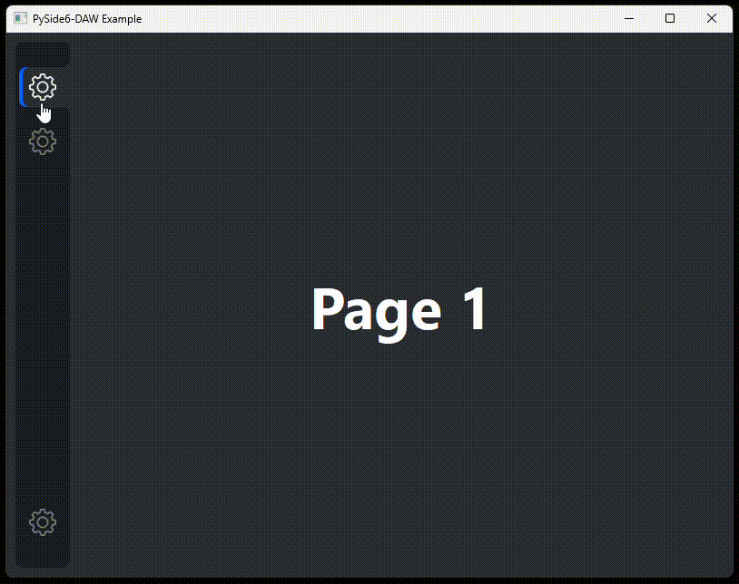

[](https://github.com/maerkl24/PySide6-DAW/actions/workflows/formatting.yml)
[](https://github.com/maerkl24/PySide6-DAW/actions/workflows/linting.yml)

# PySide6DAW

Desktop Application Widget (DAW) for PySide6. ``PySide6DAW`` is designed as Python package and provides additional
widgets, especially for desktop applications. The aim of ``PySide6DAW`` is to simplify and speedup the desktop
application development with ``PySide6``, without losing any functionality.



## Usage

The provided widgets are based on ``PySide6.QtWidgets.QWidget`` and thus can be treated as any other widget. The
following code snippet demonstrates to usage of ``PySide6DAW`` in a simple manner.

```python
from PySide6.QtGui import QPixmap
from PySide6.QtWidgets import QApplication, QMainWindow
from PySide6DAW.Widgets import DesktopApplication, SideBarButton

class MainWindow(QMainWindow):
    def __init__(self) -> None:
        super().__init__(parent=None)

        # Create desktop application widget
        desktop_app = DesktopApplication(self)

        # Add a page to the desktop application widget
        icon_1 = QPixmap(Path("my_icon.svg"))
        bttn_1 = SideBarButton(icon, "Button 1")
        page_1 = QWidget()
        desktop_app.addPage(bttn_1, SideBarButton.Alignment.TOP, page_1)

        self.setCentralWidget(desktop_app)

if __name__ == "__main__":
    app = QApplication(sys.argv)
    window = MainWindow()
    window.show()
    sys.exit(app.exec())
```

There is also a more detailed example [here](example/__main__.py).

## Development and Contribution

You would like to develop and contribute to this project? Then this chapter is what you were looking for.

### PDM

This project uses [PDM](https://pdm.fming.dev) as Python package and dependency manager. In order to develop on this
project, it is recommended to install PDM. For more information, see: <https://pdm.fming.dev/latest/#installation>

### Install Development Tools

To install the ``PySide6-DAW`` Python package with its dependencies and all development tools, execute the following
command on your terminal:

```shell
pdm install --dev
```

### Execute Development Tools

To execute the development tools, run the following commands on your terminal:

```shell
pdm run isort PySide6DAW
pdm run black PySide6DAW
pdm run pylint PySide6DAW
pdm run mypy PySide6DAW
```

## TODOs

- [ ] Fix ToolTip, currently not showing
- [ ] Evaluate making DesktopApplication inheriting from MainWindow
- [ ] Setup contribution rules
- [ ] Setup PiPy deployment
